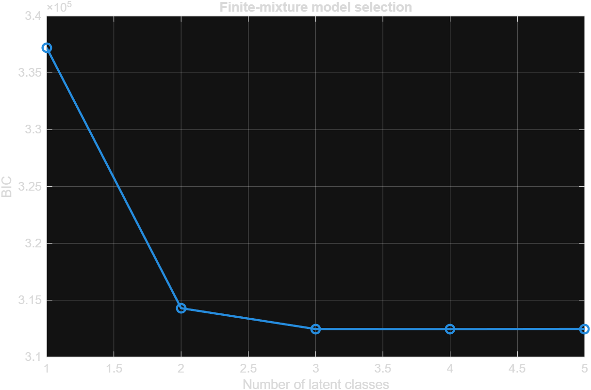
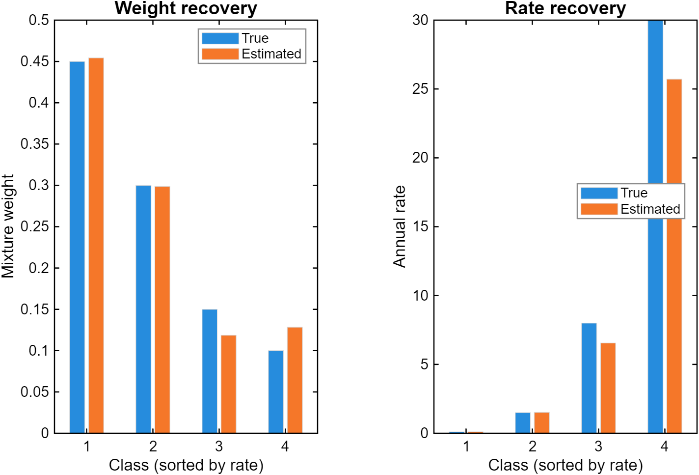
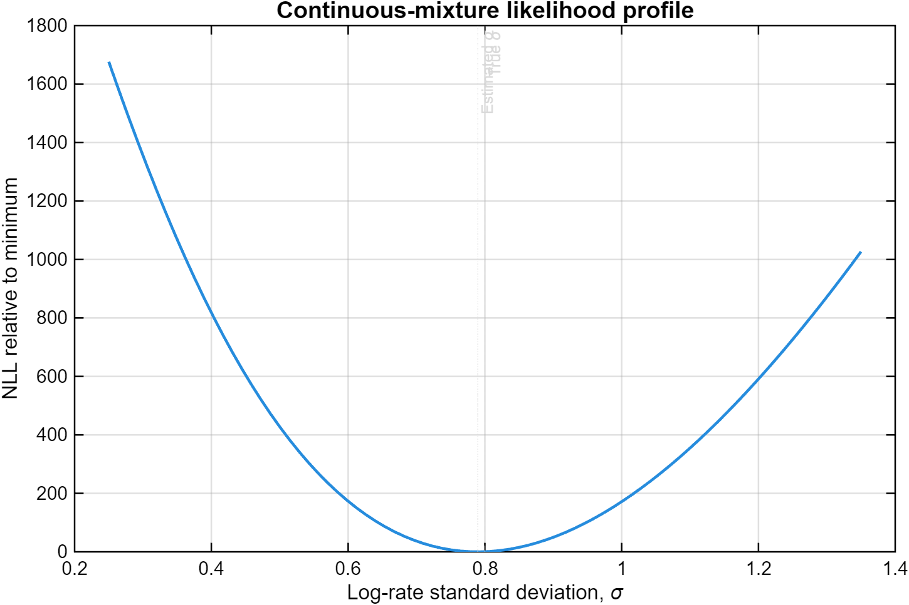

# Maximum Likelihood Estimation with Latent Heterogeneity

MATLAB implementations of three related models for recovering unobserved
heterogeneity from simulated duration data:

1. a finite mixture of exponential distributions;
2. a continuous lognormal mixture of exponential rates; and
3. a utility-based abandonment model with right-censored waiting costs.

The repository emphasizes a common Operations Research problem: decision
makers often observe event times without directly observing the heterogeneous
rates or costs that generated them.

## Motivation

Assuming every individual has the same arrival rate or waiting cost can conceal
important behavioral differences. Finite mixtures approximate heterogeneity
with latent classes, while continuous mixtures represent it with a distribution.
The censored model shows how likelihood methods can still recover heterogeneity
when some individual outcomes are only partially observed.

This project was developed as a learning exercise in simulation and maximum
likelihood estimation. It uses synthetic data and does not contain proprietary
or human-subject data.

## Mathematical background

### Finite exponential mixture

For latent class \(z_i \in \{1,\ldots,K\}\),

\[
P(z_i=k)=\pi_k,\qquad
T_i\mid z_i=k\sim\operatorname{Exponential}(\lambda_k).
\]

The marginal likelihood contribution is

\[
p(t_i)=\sum_{k=1}^{K}\pi_k\lambda_k e^{-\lambda_k t_i}.
\]

The code uses \(K-1\) logits for the mixture weights and log rates for
positivity. BIC compares candidate values of \(K\).

### Continuous rate mixture

The individual exponential rate is lognormal:

\[
\log \lambda_i\sim\mathcal N(\mu,\sigma^2),\qquad
T_i\mid\lambda_i\sim\operatorname{Exponential}(\lambda_i).
\]

The marginal density

\[
p(t_i)=\int_0^\infty \lambda e^{-\lambda t_i}
f_{\text{LN}}(\lambda;\mu,\sigma)\,d\lambda
\]

has no convenient elementary form, so it is evaluated with Gauss–Hermite
quadrature.

### Censored waiting costs

An individual with service reward \(r\) and waiting cost \(c_i\) abandons at
\(T_i^*=r/c_i\). An abandonment reveals \(T_i^*\) exactly, while service at
time \(s_i<T_i^*\) only reveals \(c_i<r/s_i\). Exact abandonments therefore
contribute a transformed lognormal density, and served observations contribute
a lognormal CDF.

## Methods and numerical safeguards

- Reproducible simulation with explicit random seeds
- Unconstrained parameterizations for weights and positive parameters
- Multiple random starts to reduce sensitivity to local optima
- Log-sum-exp likelihood evaluation to prevent numerical underflow
- Normalized Gauss–Hermite weights
- Explicit optimization-failure checks
- Parameter-recovery and likelihood tests

## Repository structure

```text
.
├── examples/   Reproducible end-to-end demonstrations
├── figures/    Curated model-selection and recovery figures
├── src/        Simulation, likelihood, and estimation functions
└── tests/      MATLAB unit and recovery tests
```

## Requirements

- MATLAB R2022b or newer recommended
- Statistics and Machine Learning Toolbox
- Optimization Toolbox

No external data is required.

## How to run

Open MATLAB in the repository root:

```matlab
cd examples
run_finite_mixture_demo
run_continuous_mixture_demo
run_censored_waiting_cost_demo
```

Run all tests from the repository root:

```matlab
cd tests
run_all_tests
```

The examples use moderate sample sizes so they can be inspected quickly.
Increase sample sizes and random starts for a more intensive recovery study.

## Example output







## Results

With sufficiently separated components and adequate sample sizes, BIC recovers
the finite mixture's data-generating class count and the MLEs approach the true
weights and rates. Gauss–Hermite quadrature recovers the location and scale of
continuous lognormal rate heterogeneity. The censored likelihood recovers the
waiting-cost distribution without treating service times as exact abandonment
times.

Exact numerical estimates vary with the random seed, sample size, quadrature
order, and optimizer starts.

## Limitations

- Mixture likelihoods can have local optima and label switching.
- Closely spaced or low-weight components may be weakly identified.
- BIC does not guarantee correct class-count recovery in every sample.
- The continuous model assumes lognormal rate heterogeneity.
- The censoring model assumes waiting cost is constant within an individual
  and service time is independent of latent waiting cost.
- The examples use synthetic data and demonstrate methods rather than a
  domain-specific empirical conclusion.

## Future improvements

- Bootstrap confidence intervals and repeated-sample coverage studies
- Comparison with expectation-maximization
- Alternative mixing distributions
- Covariate-dependent class membership or rates
- Bayesian versions of the same models
- Performance benchmarks for vectorized and parallel multi-start estimation
